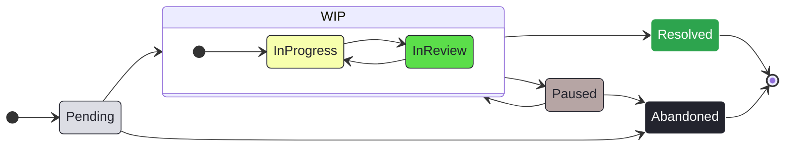

# Contributing

A guide on how to contribute to 'voice-revive'.

## Table of Contents

- [Branching](#branching)
    - [Main](#main)
    - [Dev](#dev)
    - [Feature Branches](#feature-branches)
- [Commits](#commits)
- [Issue Tracking](#issue-tracking)
    - [Issue States](#issue-states)
    - [Issue Creation](#issue-creation)
    - [Priority & Size](#priority--size)
- [JUCE Development Environment](#juce-development-environment)
- [Flutter Development Environment](#flutter-development-environment)
    - [Formatting](#formatting)
    - [Linting](#linting)
    - [Flutter Project Structure](#project-structure)
- [CI/CD](#cicd)
    - [Documentation](#documentation)

## Branching

### Main

This project follows a standard approach. The `main` branch is for **stable, production-ready** release versions of the code. It is also the repository's default branch.  
**Only** the `dev` branch is allowed to interact with `main` via merges or rebases.  
Exceptions are solely made for branches that are associated with an issue of `Critical` priority ([see Priority and Size](#priority--size)).  

### Dev

The `dev` branch exists for **ongoing changes**. [Feature branches](#feature-branches) divert from here and are integrated back via merges or rebases.  
The bare minimum for a merge/rebase of a feature branch into `dev` is a passing pipeline **and** fulfilling all acceptance criteria of the issue.  

### Feature Branches

Each feature branch **must** have an associated issue, and in fact, **must** be created from an issue ([see Issue Creation](#issue-creation) step 11, and step 1 to 5).  
In turn, each issue **must** be created from an issue form ([see Issue Creation](#issue-creation) step 1 to 5) and **not** via a blank issue.  
The names of branches follow the pattern `[issue-number]-[kebap-cased-issue-type]-[kebap-cased-issue-name]` (without brackets).  
This is generated automatically by following the specified process for [issue creations](#issue-creation), especially step 6.  

## Commits

Commit messages must follow [Conventional Commits](https://www.conventionalcommits.org/en/v1.0.0/).  
Therefore, each contributing person should have an appropriate tool installed locally, which enforces these conventions.
This project uses the [Conventional Commits](https://marketplace.visualstudio.com/items?itemName=vivaxy.vscode-conventional-commits) extension for Visual Studio Code.

## Issue Tracking

**GitHub Projects** is used for issue tracking and creation (and implicitly for branch creation).

### Issue States

There are six columns, which indicate the status of an issue:

- `Pending`: Issues in here are neither accepted nor rejected yet.
- `InProgress`: Issues in here were accepted and are currently being worked on.
- `InReview`: Issues in here are review ready or currently being reviewed.
- `Resolved`: Issues in here were reviewed and afterwards got merged into one of the main branches.
- `Paused`: Issues in here were started in the past but are currently not being worked on.
- `Abandoned`: Issues in here will not be resolved.

Issues can be moved between these columns via _drag and drop_ to change their state.  
Issues that are moved into `Resolved` must be `closed as completed`.  
Issues that are moved into `Abandoned` must be `closed as not planned`.  
Here, a visualization over possible state changes:

Of course, the ideal workflow would be `None`→`InProgress`→`InReview`→`Resolved`.

### Issue Creation

Issues are created in the project's `backlog` view.

1. In the `Pending` column, click `+ Add Item`.
2. Click the `+` appearing to the left.
3. Click `Create new issue`.
4. Make sure that the correct repository is selected at the top.
5. Then, choose an adequate issue form. Each form has an aiding description text.
6. Change the kebap-cased part of the issue's title (keep it in **lowercase**).
7. Fill out as much fields as possible. At least, all necessary fields must be non-empty. These fields are marked by a red `*`.
8. Click on `Create`.
9. Select the new issue in the `backlog` view.
10. Set assignees, priority, and size. Optionally, add more fitting `Flag:` or `For:` labels.
11. As soon as active work on the issue starts: Select the issue in the `backlog` view, then click `Create a branch` on the right.
12. Make sure the `repository destination` is correct and the `branch source` is set to `dev` (except for issues with `Critical` priority where it should be `main`, see below)

**Never** add, remove, or change any associations (or the lack thereof) between an issue and its predefined `Type:` label.

### Priority & Size

Each issue needs an associated **priority**. There are four different values available:

- `Low`: The issue should be resolved at some point, but only if there is no issue with a higher priority present.
- `Medium`: The issue should be resolved in the near future and only trumps low-priority issues.
- `High`: The issue should be resolved as soon as possible and can only be trumped by a critical-priority issue.
- `Critical`: Reserved for hotfixes of the main branches, like, security issues, critical bugs, etc.

Each issue needs a **size estimation**. There are four different values available for estimating the amount of work for an issue:

- `Small`: The issue can probably be dealt with within a single day of concentrated work by the team.
- `Medium`: The issue can probably be dealt with within a single week of concentrated work by the team.
- `Large`: The issue can probably be dealt with within a single month of concentrated work by the team.
- `Longterm`: The issue probably needs at least a month of concentrated work by the team.

## JUCE Development Environment

For the Audioprocessing in the Backend we use the framework [JUCE](https://juce.com/). The current version of the app is also made using this framework. It has a very good documentation and tutorials of its own. The whole Github-Project is also found in the [juce folder](./juce-8.0.0-windows/) of this Repro. To install it and set it up you can just follow one of the following YouTube-Videos. As an IDE for the AudioPlugins we used Visual Studio 2022 and for the app Android Studio.

For our Audio-Plugins we followed 2 YouTube-Tutorials about an [Equalizer](https://www.youtube.com/watch?v=i_Iq4_Kd7Rc) and a [Compressor](https://www.youtube.com/watch?v=H1IvfOfBsVQ&t=143s). Every necessary concept is explained. It is important to mention, that we just followed them until the UI Design started.

## Flutter Development Environment

The app frontend is developed in Visual Studio Code (VSCode).  
VSCode's in-built [workspace extensions and settings recommendation system](https://code.visualstudio.com/docs/editor/extension-marketplace#_workspace-recommended-extensions) is used to share and synchronize configurations of the development environment across the team.  
These workspace extensions and settings **must** be used by all contributors to ensure a consistent development environment.

- [Conventional Commits](https://marketplace.visualstudio.com/items?itemName=vivaxy.vscode-conventional-commits)
- [Flutter](https://marketplace.visualstudio.com/items?itemName=Dart-Code.flutter)

Follow this [installation guide](https://flutter.dev/docs/get-started/install) to set up the Flutter SDK on your machine.
After a successful installation, you will also have [Android Studio](https://developer.android.com/studio) installed on your system.
For development purposes, we run our code on a virtual device, specifically a **Pixel 5** on **Android 14.0 ("UpsideDownCake")** with **API level 34**.
Respectively, set them up via the **SDK Manager** and the **Device Manager** inside Android Studio.
If done right, the virtual device should also be available in VSCode when running the command `Flutter: Select Device` in the command palette (`Ctrl+Shift+P`).

### Formatting

The project uses the pre-bundled [dart formatter](https://dart.dev/tools/dartfmt) to format the code.
Usually, VSCode should automatically pick it after installing the [Flutter](https://marketplace.visualstudio.com/items?itemName=Dart-Code.flutter) extension.
A good practice is to format often, especially before committing.
Therefore, the formatter should be set to format on save.
However, it won't work, as long as there are syntax errors in the code and it also won't work, if auto-save is enabled (in VSCode).
To run the formatter manually on the currently selected file, use the shortcut `Alt+Shift+F`.
Alternatively, use the command `dart format` in the terminal.
The latter lets you specify multiple files or even directories.

Optionally, install the [flutter stylizer](https://marketplace.visualstudio.com/items?itemName=gmlewis-vscode.flutter-stylizer) VSCode extension.
It is not in the workspace recommendations, as it is unfortunately archived (among other caveats).
By itself, it can only be run manually on a single file via the command palette (`Ctrl+Shift+P`): `Flutter Stylizer`.
Be careful while using it, because it can produce big git diffs.

### Linting

The project uses the [dart analyzer](https://pub.dev/packages/analyzer) to check for linting issues.
The rules are defined in the `analysis_options.yaml` file.
The base rule set is [flutter lints](https://pub.dev/packages/flutter_lints) (which itself is a superset of the [officially recommended dart ruleset](https://pub.dev/packages/lints)) and it is even mentioned in the official dart documentation.
Additionally, all linter rules (for Dart SDK version 3.4.3) were sighted and many were added to the `analysis_options.yaml` file.
Please conform to these rules before committing, even if they are not marked as errors.

Applying the [formatter](#formatting) can already resolve many linting issues.
Many issues are also automatically fixable by running the command `dart fix --apply` in the terminal.
To only preview the changes, use `dart fix --dry-run`.

### Project Structure

This section discusses the contents of the `lib` directory, the conventional folder that holds a Flutter project's source code.

 - `core` holds the individual components, like widgets, reusable functions, styles, etc. that can be (re-)used to build a screen in the app.
   - `routers` holds the global routing logic, i.e. which path (with which display text and icon) leads to which screen.
   - `utils` holds constants and reusable components to reduce code duplicates.
     - `styles` holds styling information; `default_theme.dart` inside it overrides Flutter's default styles, basically setting our own 'default', and defines some style constants.
     - `widgets` holds the main building blocks of the app frontend, each widget gets its own directory; the directory hierarchy below could be flattened in the future and, retrospectively, was admittetly over-engineered.
- `screens` holds the screens that are composed out of smaller components; the directory hierarchy below could be flattened in the future and, retrospectively, was admittetly over-engineered.
- `main.dart` is the entry point of the app.

## CI/CD

The project uses GitHub Actions for CI/CD.

### Documentation

This project uses [dart doc](https://dart.dev/tools/dart-doc) to generate the app frontend documentation.
It scans the source code for **documentation comments** and generates HTML files into `docs`.
**Do not** delete the contents of `docs/categories` as they are manually created rather than generated.
The configuration for `dart doc` resides in `dartdoc_options.yaml`.

**Do not** generate documentation locally and **do not** commit such files.
Documentation is automatically (re-)generated by the CI/CD pipeline every time there is a **push** to `dev` or to `main` but **only if** the app code changed.
This workflow is defined in `.github/workflows/dartdoc.yml`.

The generated documentation is automatically published to **GitHub Pages** at [voice-revive.github.io/voice-revive](https://ike-b.github.io/voice-revive/).
It uses the documentation in the `dev` branch.
Currently, there exists no custom workflow for publishing the documentation.
It is just the default workflow that got activated in the repository settings.
