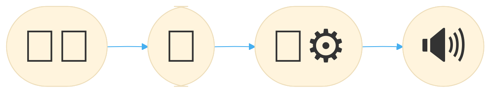

# voice-revive

This project aims to **improve the speech quality of laryngectomy patients** by developing a smartphone application.

## Table of Contents

- [Overview](#overview)
- [Project Structure](#project-structure)
- [Documentation](#documentation)
- [Hardware-Setup](#hardware-setup)
- [Contributing](#contributing)
- [Acknowledgements](#acknowledgements)

## Overview

Due to the removal of the larynx during this procedure, the **speech capabilities** of these patients are **severely impaired**.
While current solutions can restore their speech in a way, patients report problems like not being able to speak loudly, having a deep and rough voice, fast speaking fatigue, communication issues with strangers, ...

The goal of this project is to develop a **smartphone application** where:
1. users can speak with less (fatiguing) loudness
2. into a **microphone**, which sends the audio signal to
3. a smartphone that performs **audio transformations** on the incoming audio-stream in **real-time**, and
4. outputs the transformed audio to a **speaker** that drowns out the original voice.

The app provides multiple degrees of freedom for users to adjust their voice transformation to their liking.
This solution offers an improvement of the speech quality **on top of current treatments without further surgery or medical intervention**.
It only needs relatively cheap, commonly available hardware.

The two biggest challenges are implementing audio transformations that can achieve the desired voice quality and ensuring that they are applied in **real-time**,
to avoid jamming the speech of the users themselves.
Additionally, the app must be developed with special care for **usability and accessibility**, as the target group consists of elderly people in most parts.

The app is developed in [Flutter](https://flutter.dev/), so it can be deployed on both **Android and iOS** devices.
Audio processing is done in [JUCE](https://juce.com/), a *C++* framework for audio applications, which makes a real-time audio processing possible.

## Project Structure

`.github` contains repository related files like issue templates and workflows.

`.vscode` contains development related settings for Visual Studio Code.

`docs` contains documentation related files of the project. Do not consult the contents of this folder directly, but rather use the [human readable online documentation](https://ike-b.github.io/voice-revive/).

`revoiceme` contains the source code of the app.

## Documentation

An up-to-date **code documentation** (of the app frontend written in Dart/Flutter) of this project is available online at: [ike-b.github.io/voice-revive](https://ike-b.github.io/voice-revive/).

The usage itself is quite intuitive.
After opening the app, the "Start/Stop" button can be used to toggle the voice changing.
If the app somehow detected the wrong speaker or microphone, the periphery can be changed in the tab "Audiogeraet" under "Input" and "Output".
Per default, the voice should sound nearly unaltered.
To tune voice manipulation to one's concrete needs, users can experiment with the settings under "Konfiguration".
Because of its pure experimental nature, the app currently does not store configurations after exiting it. 

Stopping the voice changing via the button causes the app to select the default devices again (instead of the last user selected devices).
So changing the periphery must be done while voice changing is active.

## Contributing

Consult the [CONTRIBUTING.md](CONTRIBUTING.md) for all necessary information about the complete development cycle of this project: from how to opening issues, to setting up the development environment, to eventually integrating changes into the main codebase.

## Hardware-Setup

To run the app succesfully on a smartphone, an **externally** connected **directional** mircophone and an **external** speaker are needed.
Additionally, to connect both at the same time, a 2-to-1 (AUX) adapter is needed as well.

We tested our app with the following equipment:

- a Google Pixel 5 with 8 GB RAM and 128 GB storage
- a [Rode AI-Micro](https://rode.com/de/interfaces-and-mixers/ai-series/ai-micro) as adapter for two parallel AUX-Inputs
- a [Giecy speech enhancer](https://www.amazon.de/dp/B07VRPY2DT/?tag=glv-21&ascsubtag=dd0c82bc-5c9a-4a14-86c2-2772675619be&th=1&linkCode=osi) as speaker and microphone

This is **not** an advertisement. This is just the hardware we used during development where we tested the functionality.
Every other smartphone, directional microphone, speaker, and 2-to-1 (AUX) adapter should work as well.

## Acknowledgements

We express our gratitude to the [Vogel Stiftung Dr. Eckernkamp](https://www.vogel-stiftung.de/) as well as the [ImDS](https://www.ukw.de/interdisziplinaere-einrichtungen/institut-fuer-medizinische-datenwissenschaften/startseite/#) for their support. Without their support, this project would not have been possible.

## Project-Onboarding

For general information about the work flow and Hardware-Setup read [CONTRIBUTING](./CONTRIBUTING.md) or [Hardware-Setup](#hardware-setup).

This section is devided into two parts. One for the Backend developement and use of JUCE and one for the Frontend developement and Flutter.

### JUCE

For the Audioprocessing in the Backend we use the framework [JUCE](https://juce.com/). The current version of the app is also made using this framework. It has a very good documentation and tutorials of its own. The whole Github-Project is also found in the [juce folder](./juce-8.0.0-windows/) of this Repro. To install it and set it up you can just follow one of the following YouTube-Videos. As an IDE for the AudioPlugins we used Visual Studio 2022 and for the app Android Studio.

For our Audio-Plugins we followed 2 YouTube-Tutorials about an [Equalizer](https://www.youtube.com/watch?v=i_Iq4_Kd7Rc) and a [Compressor](https://www.youtube.com/watch?v=H1IvfOfBsVQ&t=143s). Every necessary concept is explained. It is important to mention, that we just followed them until the UI Design started.

### Flutter
