# voice-revive

This project aims to **improve the speech quality of laryngectomy patients** by developing a smartphone application.

## Table of Contents

- [Overview](#overview)
- [Project Structure](#project-structure)
- [Documentation](#documentation)
- [Contributing](#contributing)
- [Acknowledgements](#acknowledgements)

## Overview

Due to the removal of the larynx during this procedure, the **speech capabilities** of these patients are **severely impaired**.
While current solutions can restore their speech in a way, patients report problems like not being able to speak loudly, having a deep and rough voice, fast speaking fatigue, communication issues with strangers, ...

The goal of this project is to develop a **smartphone application** where:
1. users can speak with less (fatiguing) loudness
2. into a **microphone**, which sends the audio signal to
3. a smartphone that performs **audio transformations** on the incoming audio-stream in **real-time**, and
4. outputs the transformed audio to a **speaker** that drowns out the original voice.

```mermaid
%%{
  init: {
    'theme': 'base',
    'themeVariables': {
      'fontSize': '56px',
      'lineColor': '#46AFF0'
    }
  }
}%%

  flowchart LR
  
    A([👤💬])
    A --> B([🎤])
    B --> C([📱⚙️])
    C --> D([🔊])
```

The app provides multiple degrees of freedom for users to adjust their voice transformation to their liking.
This solution offers an improvement of the speech quality **on top of current treatments without further surgery or medical intervention**.
It only needs relatively cheap, commonly available hardware.

The two biggest challenges are implementing audio transformations that can achieve the desired voice quality and ensuring that they are applied in **real-time**,
to avoid jamming the speech of the users themselves.
Additionally, the app must be developed with special care for **usability and accessibility**, as the target group consists of elderly people in most parts.

The app is developed in [Flutter](https://flutter.dev/), so it can be deployed on both **Android and iOS** devices.
Audio processing is done in [JUCE](https://juce.com/), a *C++* framework for audio applications, which makes a real-time audio processing possible.

## Project Structure

`.github` contains repository related files like issue templates and workflows.

`.vscode` contains development related settings for Visual Studio Code.

`docs` contains documentation related files of the project. Do not consult the contents of this folder directly, but rather use the [human readable online documentation](https://ike-b.github.io/voice-revive/).

`revoiceme` contains the source code of the app.

## Documentation

An up-to-date documentation of this project is available online at: [ike-b.github.io/voice-revive](https://ike-b.github.io/voice-revive/).

## Contributing

Consult the [CONTRIBUTING.md](CONTRIBUTING.md) for all necessary information about the complete development cycle of this project: from how to opening issues, to setting up the development environment, to eventually integrating changes into the main codebase.

## Hardware-Setup
To run the app succesfully a connected mircofon and a speaker is needed. Therefore every normal mircofon and speaker should work. We ourselves only tested and developed the app with 2 specific ones. This is not any advertisement in any way, we just want to point out that with these tools the app works as intended.

Our test-phone is the Google Pixel 5 with 8 GB RAM and 128 GB storage. It will be connected with [a Rode AI microfon](https://rode.com/de/interfaces-and-mixers/ai-series/ai-micro) to have two possible AUX-Inputs. For the mircofon and speaker we use the [Giecy speech enhancer](https://www.amazon.de/dp/B07VRPY2DT/?tag=glv-21&ascsubtag=dd0c82bc-5c9a-4a14-86c2-2772675619be&th=1&linkCode=osi), these are then connected to the Rode AI microfon.

## Acknowledgements

We express our gratitude to the [Vogel Stiftung Dr. Eckernkamp](https://www.vogel-stiftung.de/) as well as the [ImDS](https://www.ukw.de/interdisziplinaere-einrichtungen/institut-fuer-medizinische-datenwissenschaften/startseite/#) for their support. Without their support, this project would not have been possible.
